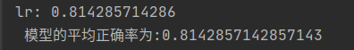

- pandas
- Numpy
- Scikit-Learn

# 挖掘建模
> 经过数据探索与数据预处理,得到了可以直接建模的数据。根据挖掘目标和数据形式可以建立分类与预测、聚类分析、关联
规则、时序模式和偏差检测等模型,帮助企业提取数据中蕴含的商业价值,提高企业的竞争力。


>分类和预测是预测问题的两种主要类型,分类主要是预测分类标号(离散属性),而预测主要是建立连续值函数模型,预测给定自变量对应的因变量的值。
>
## 常见分类预测算法

算法名称 | 算法描述 | 备注    
------- | ---------------- | ----------:
回归分析 | 回归分析是决定预测属性（数值型）与其他变量间互相依赖的定量关系最常用的统计学方法．包括线性回归，非线性回归，Logistic回归,岭回归，主成分回归，偏最小二乘回归|  
决策树 | 决策树采用自顶向下的递归方式，在内部节点进行属性值的比较，并根据不同的属性值从该节点向下分支 ，最终得到的叶子节点是学习划分的类    | mild 
人工神经网络  | 人工神经网络是一种模仿大脑神经网络结构的和功能而建立的信息处理系统，表示神经网络的输入和输出之间关系的模型|
贝叶斯网络 | 贝叶斯网络又称信度网络，　是Ｂａｙｅｓ方法的扩展，是目前不确定知识表达和推理领域最有效的理论模型之一|　  
支持向量机 | 支持向量机是一种通过某种非线性映射，把低维的非线性可分转化为高维的线性可分，在高维空间进行线性分析的算法|  
## 回归分析


## Logistic回归
在scikit-learn中，与逻辑回归有关的主要是这3个类。
- [LogisticRegression](https://scikit-learn.org/stable/modules/generated/sklearn.linear_model.LogisticRegression.html?highlight=logisticregression#sklearn.linear_model.LogisticRegression) :需要自己每次指定一个正则化系数
- [LogisticRegressionCV](https://scikit-learn.org/stable/modules/generated/sklearn.linear_model.LogisticRegressionCV.html?highlight=logisticregression#sklearn.linear_model.LogisticRegressionCV) :使用了交叉验证来选择正则化系数C,除了交叉验证，以及选择正则化系数C以外， LogisticRegression和LogisticRegressionCV的使用方法基本相同。
- logistic_regression_path:比较特殊，它拟合数据后，不能直接来做预测，只能为拟合数据选择合适逻辑回归的系数和正则化系数。主要是用在模型选择的时候。一般情况用不到这个类
[逻辑回归错误总结](https://blog.csdn.net/sheep8521/article/details/85105221)
### 对某银行在降低贷款拖欠率的数据进行逻辑回归建模

    <table>
   <tr>
      <td>年龄</td>
      <td>教育</td>
      <td>工龄</td>
      <td>地址</td>
      <td>收入</td>
      <td>负债率</td>
      <td>信用卡负债</td>
      <td>其他负债</td>
      <td>违约</td>
   </tr>
   <tr>
      <td>41</td>
      <td>3</td>
      <td>17</td>
      <td>12</td>
      <td>176.00</td>
      <td>9.30</td>
      <td>11.36</td>
      <td>5.01</td>
      <td>1</td>
   </tr>
   <tr>
      <td>27</td>
      <td>1</td>
      <td>10</td>
      <td>6</td>
      <td>31.00</td>
      <td>17.30</td>
      <td>1.36</td>
      <td>4.00</td>
      <td>0</td>
   </tr>
   <tr>
      <td>40</td>
      <td>1</td>
      <td>15</td>
      <td>14</td>
      <td>55.00</td>
      <td>5.50</td>
      <td>0.86</td>
      <td>2.17</td>
      <td>0</td>
   </tr>
   <tr>
      <td>41</td>
      <td>1</td>
      <td>15</td>
      <td>14</td>
      <td>120.00</td>
      <td>2.90</td>
      <td>2.66</td>
      <td>0.82</td>
      <td>0</td>
   </tr>
   <tr>
      <td>24</td>
      <td>2</td>
      <td>2</td>
      <td>0</td>
      <td>28.00</td>
      <td>17.30</td>
      <td>1.79</td>
      <td>3.06</td>
      <td>1</td>
   </tr>
   <tr>
      <td>41</td>
      <td>2</td>
      <td>5</td>
      <td>5</td>
      <td>25.00</td>
      <td>10.20</td>
      <td>0.39</td>
      <td>2.16</td>
      <td>0</td>
   </tr>
   <tr>
      <td>39</td>
      <td>1</td>
      <td>20</td>
      <td>9</td>
      <td>67.00</td>
      <td>30.60</td>
      <td>3.83</td>
      <td>16.67</td>
      <td>0</td>
   </tr>
   <tr>
      <td></td>
   </tr>
</table><table>
   <tr>
      <td>年龄</td>
      <td>教育</td>
      <td>工龄</td>
      <td>地址</td>
      <td>收入</td>
      <td>负债率</td>
      <td>信用卡负债</td>
      <td>其他负债</td>
      <td>违约</td>
   </tr>
   <tr>
      <td>41</td>
      <td>3</td>
      <td>17</td>
      <td>12</td>
      <td>176.00</td>
      <td>9.30</td>
      <td>11.36</td>
      <td>5.01</td>
      <td>1</td>
   </tr>
   <tr>
      <td>27</td>
      <td>1</td>
      <td>10</td>
      <td>6</td>
      <td>31.00</td>
      <td>17.30</td>
      <td>1.36</td>
      <td>4.00</td>
      <td>0</td>
   </tr>
   <tr>
      <td>40</td>
      <td>1</td>
      <td>15</td>
      <td>14</td>
      <td>55.00</td>
      <td>5.50</td>
      <td>0.86</td>
      <td>2.17</td>
      <td>0</td>
   </tr>
   <tr>
      <td>41</td>
      <td>1</td>
      <td>15</td>
      <td>14</td>
      <td>120.00</td>
      <td>2.90</td>
      <td>2.66</td>
      <td>0.82</td>
      <td>0</td>
   </tr>
   <tr>
      <td>24</td>
      <td>2</td>
      <td>2</td>
      <td>0</td>
      <td>28.00</td>
      <td>17.30</td>
      <td>1.79</td>
      <td>3.06</td>
      <td>1</td>
   </tr>
   <tr>
      <td>41</td>
      <td>2</td>
      <td>5</td>
      <td>5</td>
      <td>25.00</td>
      <td>10.20</td>
      <td>0.39</td>
      <td>2.16</td>
      <td>0</td>
   </tr>
   <tr>
      <td>39</td>
      <td>1</td>
      <td>20</td>
      <td>9</td>
      <td>67.00</td>
      <td>30.60</td>
      <td>3.83</td>
      <td>16.67</td>
      <td>0</td>
   </tr>
   <tr>
      <td></td>
   </tr>
</table>

```python
path = os.getcwd()

"""
逻辑回归
自动建模
"""


def programmer_1():
    filename = path + "/data/bankloan.xls"
    data = pd.read_excel(filename)

    # x = data.iloc[:, :8].as_matrix()
    x = data.iloc[:, :8].values  # 提取所有行，０到８列
    y = data.iloc[:, 8].values
    # print(data.iloc[:, :8])
    # print(x)
    # print(y)

    rlr = RLR()  # 建立随机逻辑回归模型,筛选变量
    rlr.fit(x, y)  # 训练模型

    rlr_support = rlr.get_support(indices=True)  # 获取特征筛选结果,也可以通过.scores 方法获取各个特征的分数
    """
    这里rlr.get_support(indices=True)如果没有indices=True会报错
    机器学习之逻辑回归错误总结: https://blog.csdn.net/sheep8521/article/details/85105221
    """

    # x = data[data.columns[rlr_support]].as_matrix() # 筛选好特征
    x = data[data.columns[rlr_support]].values  # 筛选好特征
   

    lr = LR()  # 建立逻辑回归模型
    lr.fit(x, y)  # 用筛选后的特征数据来训练模型
    print("lr: {score}".format(score=lr.score(x, y)))
    print(u' 模型的平均正确率为:% s' % lr.score(x, y))

    # 　结果　lr: 0.814285714286


if __name__ == "__main__":
    programmer_1()
    pass
```

```csv
通过随机逻辑回归模型筛选特征结束。
有效特征为:工龄
, 地址
, 负债率
, 信用卡负债
逻辑回归模型训练结束。
模型的平均正确率为:
0.814285714286

```

利用 Scikit-Learn 对这个数据进行逻辑回归分析。首先进行特征筛选,特征筛选的方法有很多,主要包含在 Scikit_Learn 的 feature_selection 库中,比较简单的有通过 F 检验( f_regression )来给出
各个特征的 F 值和 p 值,从而可以筛选变量(选择 F 值大的或者 p 值小的特征)。其次有递归特征消除( Recursive Feature Elimination , RFE )和稳定性选择( Stability Selection )等比较新的方法。这
里使用了稳定性选择方法中的随机逻辑回归进行特征筛选,然后利用筛选后的特征建立逻辑回归模型,输出平均正确率

递归特征消除的主要思想是反复的构建模型(如 SVM 或者回归模型)然后选出最好的(或者最差的)的特征(可以根据系数来选),把选出来的特征放到一边,然后在剩余的特征上重复
这个过程,直到遍历所有特征。这个过程中特征被消除的次序就是特征的排序。因此,这是一种寻找最优特征子集的贪心算法。 Scikit-Learn 提供了 RFE 包,可以用于特征消除,还提供了
RFECV ,可以通过交叉验证来对特征进行排序。
稳定性选择是一种基于二次抽样和选择算法相结合较新的方法,选择算法可以是回归、 SVM 或其他类似的方法。它的主要思想是在不同的数据子集和特征子集上运行特征选择算法,不断
重复,最终汇总特征选择结果。比如,可以统计某个特征被认为是重要特征的频率(被选为重要特征的次数除以它所在的子集被测试的次数)。在理想情况下,重要特征的得分会接近 100% 。
稍微弱一点的特征得分会是非 0 的数,而最无用的特征得分将会接近于 0 。 Scikit-Learn 在随机 Lasso 和随机逻辑回归中有对稳定性选择的实现。
从上面的结果可以看出,采用随机逻辑回归剔除变量,分别剔除了 x2 、 x8 、 x1 、 x5 ,最终构建的模型包含的变量为常量 x3 、 x4 、 x6 、 x7 。在建立随机逻辑回归模型时,使用了默认的阈值
0.25 ,读者可以用 RLR ( selection_threshold=0.5 )手动设置阈值。此外,在本例中,使用随机 Lasso 、甚至仅仅简单地采用 F 回归( f_rgression )也能够得到类似的结果。
逻辑回归本质上还是一种线性模型,因此这里的模型有效性检验本质上还是在做线性相关检验,因此,所筛选出来的变量,说明与结果具有比较强的线性相关性,然而被筛掉的变量并不
一定就跟结果没有关系,因为它们之间有可能是非线性关系。因此,读者还需要根据问题的实际背景对筛选结果进行分析。对于非线性关系的变量筛选方法有决策树、神经网络等。

