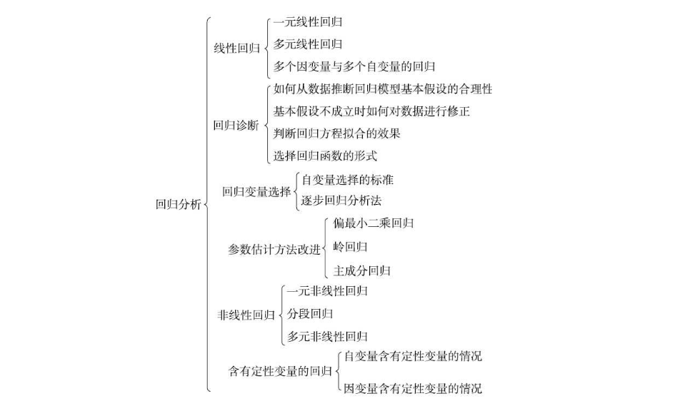

- pandas
- Numpy
- Scikit-Learn

# 挖掘建模
> 经过数据探索与数据预处理,得到了可以直接建模的数据。根据挖掘目标和数据形式可以建立分类与预测、聚类分析、关联
规则、时序模式和偏差检测等模型,帮助企业提取数据中蕴含的商业价值,提高企业的竞争力。

>分类和预测是预测问题的两种主要类型,分类主要是预测分类标号(离散属性),而预测主要是建立连续值函数模型,预测给定自变量对应的因变量的值。
>
## 常见分类预测算法

算法名称 | 算法描述 | 备注    
------- | ---------------- | ----------:
回归分析 | 回归分析是决定预测属性（数值型）与其他变量间互相依赖的定量关系最常用的统计学方法．包括线性回归，非线性回归，Logistic回归,岭回归，主成分回归，偏最小二乘回归|  
决策树 | 决策树采用自顶向下的递归方式，在内部节点进行属性值的比较，并根据不同的属性值从该节点向下分支 ，最终得到的叶子节点是学习划分的类    | mild 
人工神经网络  | 人工神经网络是一种模仿大脑神经网络结构的和功能而建立的信息处理系统，表示神经网络的输入和输出之间关系的模型|
贝叶斯网络 | 贝叶斯网络又称信度网络，　是Ｂａｙｅｓ方法的扩展，是目前不确定知识表达和推理领域最有效的理论模型之一|　  
支持向量机 | 支持向量机是一种通过某种非线性映射，把低维的非线性可分转化为高维的线性可分，在高维空间进行线性分析的算法|  
## 回归分析

## Logistic回归
在scikit-learn中，与逻辑回归有关的主要是这3个类。
- [LogisticRegression](https://scikit-learn.org/stable/modules/generated/sklearn.linear_model.LogisticRegression.html?highlight=logisticregression#sklearn.linear_model.LogisticRegression) :需要自己每次指定一个正则化系数
- [LogisticRegressionCV](https://scikit-learn.org/stable/modules/generated/sklearn.linear_model.LogisticRegressionCV.html?highlight=logisticregression#sklearn.linear_model.LogisticRegressionCV) :使用了交叉验证来选择正则化系数C,除了交叉验证，以及选择正则化系数C以外， LogisticRegression和LogisticRegressionCV的使用方法基本相同。
- logistic_regression_path:比较特殊，它拟合数据后，不能直接来做预测，只能为拟合数据选择合适逻辑回归的系数和正则化系数。主要是用在模型选择的时候。一般情况用不到这个类

### 对某银行在降低贷款拖欠率的数据进行逻辑回归建模

    <table>
   <tr>
      <td>年龄</td>
      <td>教育</td>
      <td>工龄</td>
      <td>地址</td>
      <td>收入</td>
      <td>负债率</td>
      <td>信用卡负债</td>
      <td>其他负债</td>
      <td>违约</td>
   </tr>
   <tr>
      <td>41</td>
      <td>3</td>
      <td>17</td>
      <td>12</td>
      <td>176.00</td>
      <td>9.30</td>
      <td>11.36</td>
      <td>5.01</td>
      <td>1</td>
   </tr>
   <tr>
      <td>27</td>
      <td>1</td>
      <td>10</td>
      <td>6</td>
      <td>31.00</td>
      <td>17.30</td>
      <td>1.36</td>
      <td>4.00</td>
      <td>0</td>
   </tr>
   <tr>
      <td>40</td>
      <td>1</td>
      <td>15</td>
      <td>14</td>
      <td>55.00</td>
      <td>5.50</td>
      <td>0.86</td>
      <td>2.17</td>
      <td>0</td>
   </tr>
   <tr>
      <td>41</td>
      <td>1</td>
      <td>15</td>
      <td>14</td>
      <td>120.00</td>
      <td>2.90</td>
      <td>2.66</td>
      <td>0.82</td>
      <td>0</td>
   </tr>
   <tr>
      <td>24</td>
      <td>2</td>
      <td>2</td>
      <td>0</td>
      <td>28.00</td>
      <td>17.30</td>
      <td>1.79</td>
      <td>3.06</td>
      <td>1</td>
   </tr>
   <tr>
      <td>41</td>
      <td>2</td>
      <td>5</td>
      <td>5</td>
      <td>25.00</td>
      <td>10.20</td>
      <td>0.39</td>
      <td>2.16</td>
      <td>0</td>
   </tr>
   <tr>
      <td>39</td>
      <td>1</td>
      <td>20</td>
      <td>9</td>
      <td>67.00</td>
      <td>30.60</td>
      <td>3.83</td>
      <td>16.67</td>
      <td>0</td>
   </tr>
   <tr>
      <td></td>
   </tr>
</table><table>
   <tr>
      <td>年龄</td>
      <td>教育</td>
      <td>工龄</td>
      <td>地址</td>
      <td>收入</td>
      <td>负债率</td>
      <td>信用卡负债</td>
      <td>其他负债</td>
      <td>违约</td>
   </tr>
   <tr>
      <td>41</td>
      <td>3</td>
      <td>17</td>
      <td>12</td>
      <td>176.00</td>
      <td>9.30</td>
      <td>11.36</td>
      <td>5.01</td>
      <td>1</td>
   </tr>
   <tr>
      <td>27</td>
      <td>1</td>
      <td>10</td>
      <td>6</td>
      <td>31.00</td>
      <td>17.30</td>
      <td>1.36</td>
      <td>4.00</td>
      <td>0</td>
   </tr>
   <tr>
      <td>40</td>
      <td>1</td>
      <td>15</td>
      <td>14</td>
      <td>55.00</td>
      <td>5.50</td>
      <td>0.86</td>
      <td>2.17</td>
      <td>0</td>
   </tr>
   <tr>
      <td>41</td>
      <td>1</td>
      <td>15</td>
      <td>14</td>
      <td>120.00</td>
      <td>2.90</td>
      <td>2.66</td>
      <td>0.82</td>
      <td>0</td>
   </tr>
   <tr>
      <td>24</td>
      <td>2</td>
      <td>2</td>
      <td>0</td>
      <td>28.00</td>
      <td>17.30</td>
      <td>1.79</td>
      <td>3.06</td>
      <td>1</td>
   </tr>
   <tr>
      <td>41</td>
      <td>2</td>
      <td>5</td>
      <td>5</td>
      <td>25.00</td>
      <td>10.20</td>
      <td>0.39</td>
      <td>2.16</td>
      <td>0</td>
   </tr>
   <tr>
      <td>39</td>
      <td>1</td>
      <td>20</td>
      <td>9</td>
      <td>67.00</td>
      <td>30.60</td>
      <td>3.83</td>
      <td>16.67</td>
      <td>0</td>
   </tr>
   <tr>
      <td></td>
   </tr>
</table>

