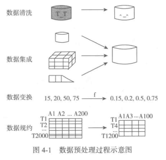
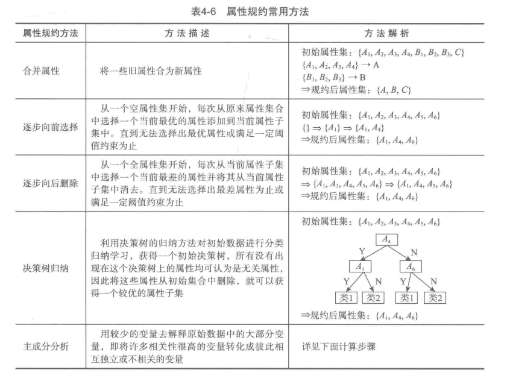

- [linux上mpltoolkits.basemap的安装](https://blog.csdn.net/zyj061/article/details/53485860)
- [Python mpl_toolkits画3D图](https://blog.csdn.net/muyimo/article/details/79376253)
- [Python 数据分析与挖掘实战](https://wizardforcel.gitbooks.io/ppdam-code-notes/content/)

# 数据预处理

- 数据清洗　：　删除原始数据集中的无关数据，重复数据，平滑噪声数据，刷选掉和挖掘主题无关的数据，处理缺失值，异常值
  - 缺失值处理：　删除记录＼数据插补＼不处理
  - 异常值处理
- 数据集成
- 数据变换
  - 简单函数变换
  - 规范化(归一化)
  - 连续属性离散化
    - 等宽法
    - 等频法
    - (一维)聚类
  - 属性构造
  - [小波变换](https://www.cnblogs.com/jfdwd/p/9249850.html)
  
- 数据规约
  - 属性规约
  
  
    - [主成分分析(PCA)](https://blog.csdn.net/program_developer/article/details/80632779)
    - [奇异值分解(SVD)](https://mp.weixin.qq.com/s/Dv51K8JETakIKe5dPBAPVg)
    - 因子分析(FA)
    - 独立成分分析(ICA)
  - 数值规约 

- python中主要数据预处理函数

# 挖掘建模

- 分类与预测
- 

# 电力窃漏电用户识别

# 航空公司客户价值分析

# 中医证型关联规则挖掘

